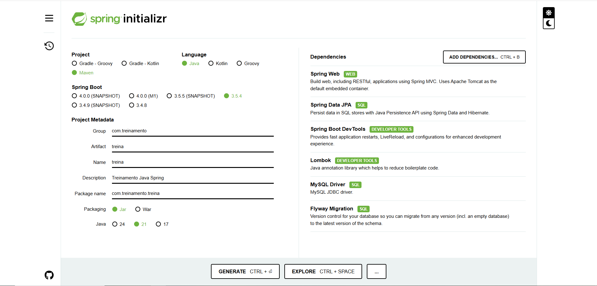

# API de Gerenciamento de Proprietários v2

Este projeto é uma API RESTful desenvolvida em Java com Spring Boot para realizar as operações básicas de um CRUD (Create, Read, Update, Delete) para a entidade `Proprietario`.

O projeto utiliza o Flyway para gerenciar as migrações do banco de dados, garantindo que o schema evolua de forma controlada e versionada.

#### Dependências


## 🚀 Tecnologias Utilizadas feito Java 21
* **Java 17+**
* **Spring Boot 3.x**
* **Spring Data JPA**: Para persistência de dados.
* **Flyway Migration**: Para versionamento de banco de dados.
* **Lombok**: Para reduzir código boilerplate (getters, setters, etc.).
* **H2 Database / MySQL**: Banco de dados relacional.
* **Maven**: Gerenciador de dependências e build.

## 💻 Pré-requisitos
Antes de começar, você vai precisar ter instalado em sua máquina:
* [Java JDK 17](https://www.oracle.com/java/technologies/javase/jdk17-archive-downloads.html) ou superior.
* [Apache Maven](https://maven.apache.org/download.cgi) 3.8 ou superior.
* Um cliente de API como [Postman](https://www.postman.com/) ou [Insomnia](https://insomnia.rest/).


## A API estará disponível em http://localhost:8080

> 1. Listar todos os Proprietários
> * Método: GET
> * Resposta de Sucesso (200 OK):
> * Endpoint: /proprietario/listar
``` json
[
    {
        "id": 1,
        "nome": "Sebastião Rodrigo",
        "email": "rodrigoexer1@gmail.com",
        "telefone": "62998579084"
    },
    {
        "id": 2,
        "nome": "Ana Carolina",
        "email": "ana.carolina@email.com",
        "telefone": "62912345678"
    }
]
```
<hr>

> 2. Listar Proprietário por ID
> * Método: GET
> * Resposta de Sucesso (200 OK):
> * Endpoint: /proprietario/listar/{id}
``` JSON
{
    "id": 1,
    "nome": "Sebastião Rodrigo",
    "email": "rodrigoexer1@gmail.com",
    "telefone": "62998579084"
}
```
<hr>

> 3. Inserir um novo Proprietário
> * Método: POST
> * Corpo da Requisição (JSON):
> * Endpoint: /proprietario/inserir
``` JSON
{
    "nome": "Carlos Pereira",
    "email": "carlos.p@email.com",
    "telefone": "21912345678"
}
```

<hr>

> 4. Editar um Proprietário existente
> * Método: PUT
> * Corpo da Requisição (JSON)
> * Endpoint: /proprietario/editar/{id}
```JSON
{
    "nome": "Sebastião Rodrigo da Silva",
    "email": "rodrigo.silva@gmail.com",
    "telefone": "62998579084"
}
```

<hr>

> 5. Delete um Proprietário existente
> * Método: DELETE
> * Corpo da Requisição (JSON)
> * Endpoint: /proprietario/delete/{id}
